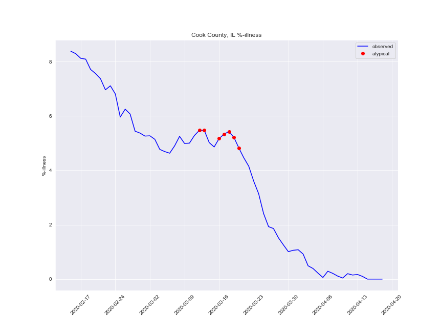
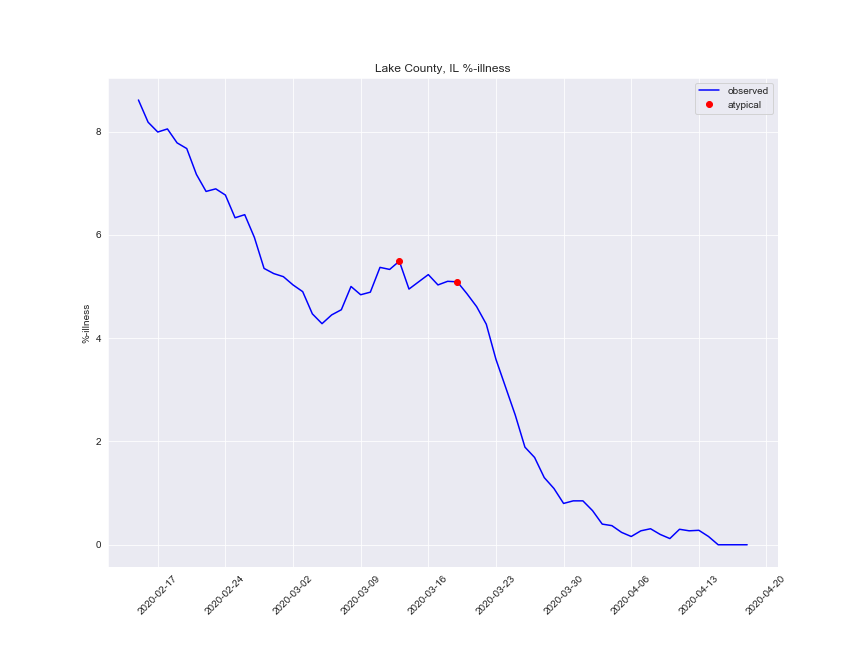

# Kinsa US Health Weather Map data scraper
This repo contains a county-level [Kinsa US Health Weather Map](https://bit.ly/3cweb9I) data scraper.



<br/>

Kinsa is a company that makes Internet-connected thermometers and publishes the subsequent temperature readings in a "US Health Weather Map" Such readings can be classified as an illness when the user has a fever, and from there Kinsa uses an [epidemiological model](https://content.kinsahealth.com/covid-detection-technical-approach) to estimate observed %-illness vs what would be expected under their model.

The scraper consists of a Jupyter notebook found in `./notebooks/scrape_kinsa_health_weather.ipynb`


## Install requirements
**1. Python requirements**

Make sure you have installed [Jupyter notebook](https://jupyter.readthedocs.io/en/latest/install.html)

Now install the required Python libraries:
```
pip install pandas matplotlib ipywidgets seaborn selenium
```

**2. JS resources to enable IPython widgets**

1. Install [node](https://nodejs.org/en/), the Javascript framework
2. Run the following commands:
```
jupyter nbextension enable --py widgetsnbextension
jupyter labextension install @jupyter-widgets/jupyterlab-manager
```

## Launch the scraper notebook
```
jupyter notebook ./notebooks/scrape_kinsa_health_weather.ipynb 
```

And then follow the instructions therein. The scraped data will be saved to .csv files in `./data` with the following columns:

| Column    | Description                                  |
|-----------|----------------------------------------------|
| condition | "observed" %-illness or "atypical" %-illness |
| date      | date of %-illness reading                    |
| county    | county name                                  |
| state     | state abbreviation                           |
| fips      | 5-digit (county, state) FIPS code            |
| illness   | %-illness recorded for county                |